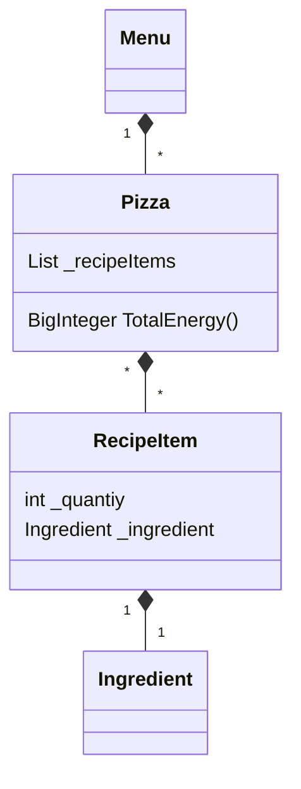

# C\#

Pizza: Pepperoni, Cheese, Pineapple

```mermaid
classDiagram
    class Menu {
    }
    class Pizza {
        List<RecipeItem> _recipeItems
        BigInteger TotalEnergy()
    }
    class RecipeItem {
        int _quantiy
        Ingredient _ingredient
    }
    class Ingredient {
    }

    Menu "1" *-- "*" Pizza
    Pizza "*" *-- "*" RecipeItem
    RecipeItem "1" *-- "1" Ingredient
```
